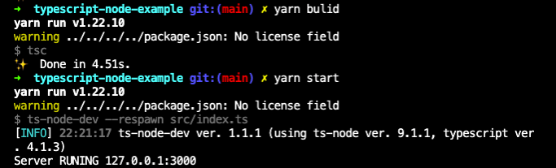

# Using TypeScript to Node.js
How to setup and use TypeScript in Node.js

## Package
```shell
$ yarn add -D typescript
$ yarn add -D ts-node
$ yarn add -D ts-node-dev
$ yarn add nodemon
$ yarn add express
$ yarn add -D @types/exprss
$ yanr add -D @types/node
```

## Bulid and Start
```json
  "scripts": {
    "start": "ts-node-dev --respawn src/index.ts",
    "dev": "nodemon --exec ts-node src/index.ts",
    "bulid": "tsc"
}
```
```shell
$ yarn build
$ yarn dev
$ yarn start
```

